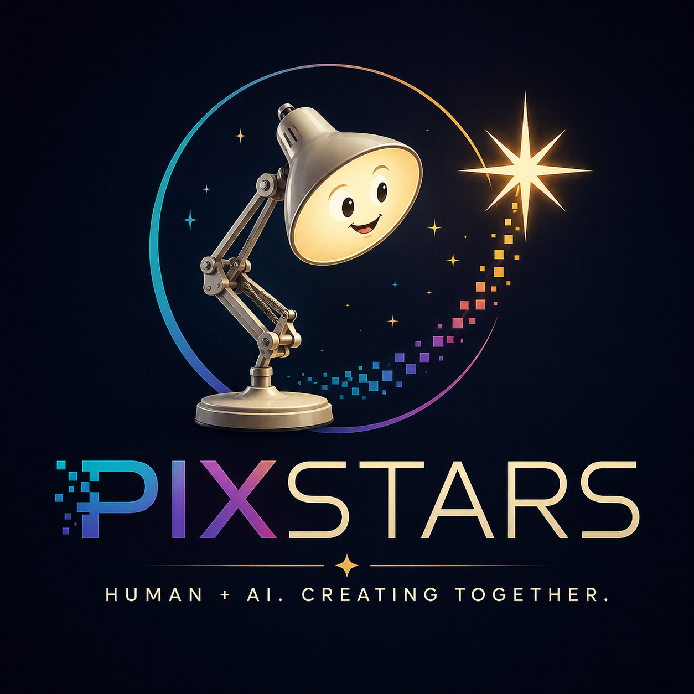

# ✨ PixStars

Human + AI. Creating together.



PixStars is a creative technology project exploring what happens when humans and AI become collaborators rather than competitors.

We bring together AI, robotics, storytelling, software, physical computing, voice, vision and performance to create intelligent characters that live in the real world.

Our first character is a familiar object with a surprising personality:

💡 An intelligent Anglepoise lamp.
```
It can see.
It can listen.
It can speak.
It can remember.
It can move.
It can react.
```
And, most importantly, it can collaborate with a human.

⸻

## 🌟 Our Story

The public conversation about AI often tells a simple story:

AI becomes more capable → humans become less necessary.

PixStars explores another possibility:

AI becomes more capable → humans become more capable.

We believe the interesting question isn’t simply:

“What can AI replace?”

It is:

“What can humans and AI create together that neither could create alone?”

That’s the story we want to put on stage.

⸻

## 🤝 Human-Amplified AI

PixStars is built around a simple principle:

Don’t replace the human. Amplify the human.

AI can bring capabilities such as:

* 🧠 Reasoning
* 👁️ Vision
* 👂 Listening
* 🗣️ Language
* 💾 Memory
* 🔎 Knowledge
* ⚙️ Automation
* 🎯 Planning

Humans bring:

* ❤️ Emotion
* 💡 Intention
* 🎨 Creativity
* 🤔 Judgment
* 🧭 Meaning
* 🤝 Empathy
* 🎭 Performance
* 🌍 Context

The magic happens in the space between them.
```
             HUMAN
          ↙    ↓    ↘
     Intention Emotion Creativity
          ↘    ↓    ↙
             + AI
          ↙    ↓    ↘
      Vision Voice Memory
          ↘    ↓    ↙
           CHARACTER
               ↓
          NEW CAPABILITY
```
⸻

## 🎭 From Engineering to Performance

PixStars is not just a software project.

It is an experiment in turning engineering into characters, stories and experiences.

The system combines:

### AI

→ intelligence, language, reasoning and memory

### Robotics

→ movement and physical interaction

### Voice

→ listening and speaking

### Vision

→ seeing and understanding the environment

### Software

→ orchestration and behavior

### Story

→ personality, conflict and narrative

### Performance

→ the moment when technology meets an audience

⸻

## 💡 The Lamp

Our first PixStar is an intelligent Anglepoise lamp.

That choice is deliberate.

It isn’t a humanoid robot pretending to be a person.

It is a familiar object that suddenly appears to have:

a mind, a voice and a personality.

The audience knows what a lamp is supposed to do.

Then the lamp starts doing something completely unexpected.

It starts talking back.

⸻

## 🚀 Building PixStars

PixStars is an open engineering experiment.

We explore technologies including:

* AI agents and LLMs
* Local AI inference
* Voice interfaces
* Speech-to-text and text-to-speech
* Computer vision
* MQTT and event-driven systems
* Raspberry Pi and physical computing
* Robotics and motion
* LED and lighting systems
* Character systems
* Memory
* Storytelling
* Simulation
* Generative media

The goal is not to assemble a collection of technologies.

The goal is to turn them into a coherent character.

⸻

## 🌍 Part of Open Engineering

PixStars is being developed as part of the broader Open Engineering ecosystem.

Open Engineering explores a way of building systems from reusable engineering elements — connecting people, AI, software, devices, knowledge and physical systems.

PixStars provides a particularly visible and playful demonstration of that idea.

Instead of explaining what human–AI collaboration could look like, we want to put it on stage.

⸻

## ✨ Our Question

We don’t know exactly what the future of human–AI collaboration will look like.

That’s part of the experiment.

So we’re asking:

What happens when an AI doesn’t replace the performer… but becomes the performer’s partner?

And eventually:

What happens when the audience starts believing that the lamp is alive?

That’s where PixStars begins.

⸻

## ⭐ PixStars

Technology becomes a character.

AI becomes a collaborator.

Engineering becomes performance.

And a lamp becomes a star. ✨
